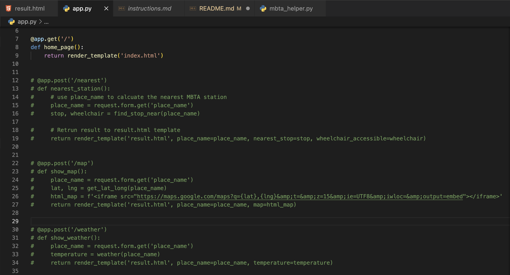

# WebApp-MBTA by Matthew Syrigos & Lily Ichise

[Markdown format](https://docs.github.com/en/get-started/writing-on-github/getting-started-with-writing-and-formatting-on-github/basic-writing-and-formatting-syntax)

## 1. Project Overview (~1 paragraph)

This project is a web application that finds the nearest MBTA station based on a user's location input, and provides additional information such as wheelchair accessibility, a map with the location of the nearest MBTA station, and the current temperature of the location the user inputted. 

The project uses the MBTA API to retrieve MBTA stop information and the OpenWeatherMap API to retreive weather information. Extensions to the basic requirements incude the flask web application used to create a user friendly interface, the map display showing the location of the station, the weather information that is provided with the help of OpenWeather API, the error handling securing the program from wrong entries and the wheelchair accessibility and location information, generated with the help of mbta helper and geolocation APIs. All the extensions used improve the user experiance and provide additional information, making the application more useful and engaging for users.

The Flask web framework is also used to handle HTTP requests and render HTML templates.

## 2. Reflection (~3 paragraphs + screenshots)

**1. The process**  
While creating the code for this project, we experianced both successful and challenging moments. We managed to create the basic applications, saved under mbta_helper, quickly and effectively as well as creating the basic functions in app.py. The challenges appeared when we created html files to function as templates for our code and demonstrate the outputs in a flask web application. Our limited knowledge of html as well as the complicated inputs and outputs we wanted to convey made it had to create those templates. To resolve this issue, we used online resources and alot of testing, trial, and error, to determine what worked and what did not. We then experianced some issues with the app.py when we tried adding more functions to the program. We initially had mulptiple functions for the results since we divided the tasks of creating additional extensions. This complicated the situation since we ended up having many resul pages. After a while we figured out and recreated the result function and page in a straight forward and successfull way.
Collaboration and genuine willingness to help among our team was crucial in succeeding in this assignment. Our project management strategy was simple yet effective. We takled all tasks in a linear form by working together and separately. Progress was reported, tested, and kept if it accompliced our goals. 

**2. Team's work division**  
For this project, we were able to divide the work very well. We mostly worked on the major parts together, and if one person started a specific aspect of the project towards the end of our group meeting, that person would just continue to work on that aspect outside the group meeting while the other person started some other part. We would always reconvene consistently to make sure we were both on the same page, and if one person got stuck on one thing, we would both work on it together. If we still couldn't come up with a solution that day, we would both think about it individually and come back to discuss. All problems solved and work completed. There weren't any issues that arose while working together, so there was nothing that we had to address. (I'd say we make a good team. - Lily)  
There honestly isn't really anything to do differently as of now. Our partnership dynamic is very good.

**3. Learnings**  
Throughout this project, we were able to learn a lot about the basics of web development and the Flask framework. This project helped us gain a better understanding and comfortability with taking user inputs and integrating multiple APIs, as well as displaying information in a user-friendly format. ChatGPT was a huge help in contributing to our learnings, as it was particularly useful in helping us understand how to use certain Python libraries and improve our code with suggestions when we got stuck with stubborn errors. Going forward, we will use our knowledge of APIs and the Flask framework on our final project of matching students with shared interests to study groups via a web application. If we wished we knew anything beforehand that could've helped us succeed, it would've been that if you want to include a map on the same result page as the nearest station, you have to include it in the same function under app.py.

This is a picture of the error that took us hours to fix. We wanted to display the temperature of the user-inputted location and the map of the station.

This is the picture of the final web application after the user inputs a location, in this case Wellesley.

This is the picture of a question asked to ChatGPT resolve an SSL verification error.

This is the picture of a question asked to ChatGPT to suggest solutions to fixing an error with displaying the map.
1[ChatGPT - Map Display Error](images/chatgpt%20issue%20with%20map.png)