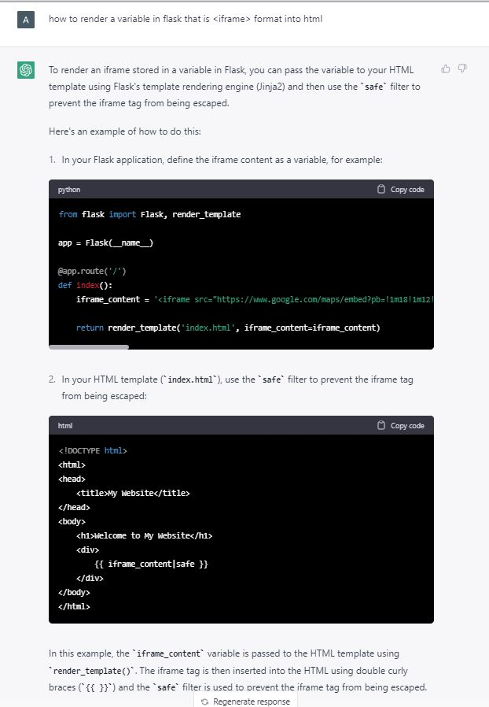
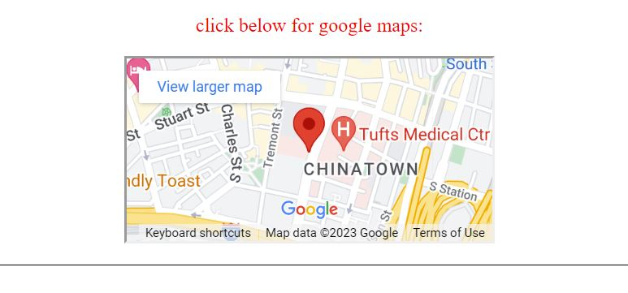

# WebApp-MBTA
 This is the base repo for Web App Developement project. Please read [instructions](instructions.md). 
# Project Overview
In this Web App Development Project, we created a MBTA helper. This helper helps users find the nearest MBTA stop and whether or not it is wheelchair accessible based off of their location. Additionally, we included the street name of the MBTA stop to give more clarity of where to find the stop. When the user enters the page, they will see the header in bold, which will catch their eye and will ask them to input their location. Under the text box is an image of the MBTA map with all the train and bus lines. We believe that by including this aspect, users are able to pinpoint the general idea of this app. 

# Reflection
Prior to this project, we both have not worked together in a team before. This and time became our greatest challenge. We were introduced to this project a week before it was due and it turned out that we were both quite busy and could not work together in person. Our initial plan was to work on it together through meetings, but because our meetings were online, we quickly noticed that it was not efficient. We would both edit the code and it would overwrite each other. As we continued, we notified the other party when we coded and blocked off time for each of us to work on the code and included detailed comments, so the other party understood what they added. This became more effective rather than both of us staring at it together.  By the end of it, we were able to get the hang of it as a team. 

Our first technical obstacle came from creating the API url. We had a lot a roadblocks when it came to this critical detail because we would try and try and the web would print out "not found." This made us realize the importance of close reading and reaching out for help. We were stuck on this for a while because without the data, we couldn't move on to the next step.

The second technical obstacle that we had was returning our results. Specifically, we struggled with returning the iframe of our google maps. We tried removing the iframe and only included the link but the image did not print. So we decided to ask chatGBT for help and was able to get the results that we wanted! Here are the images:  &nbsp;  &nbsp; 

