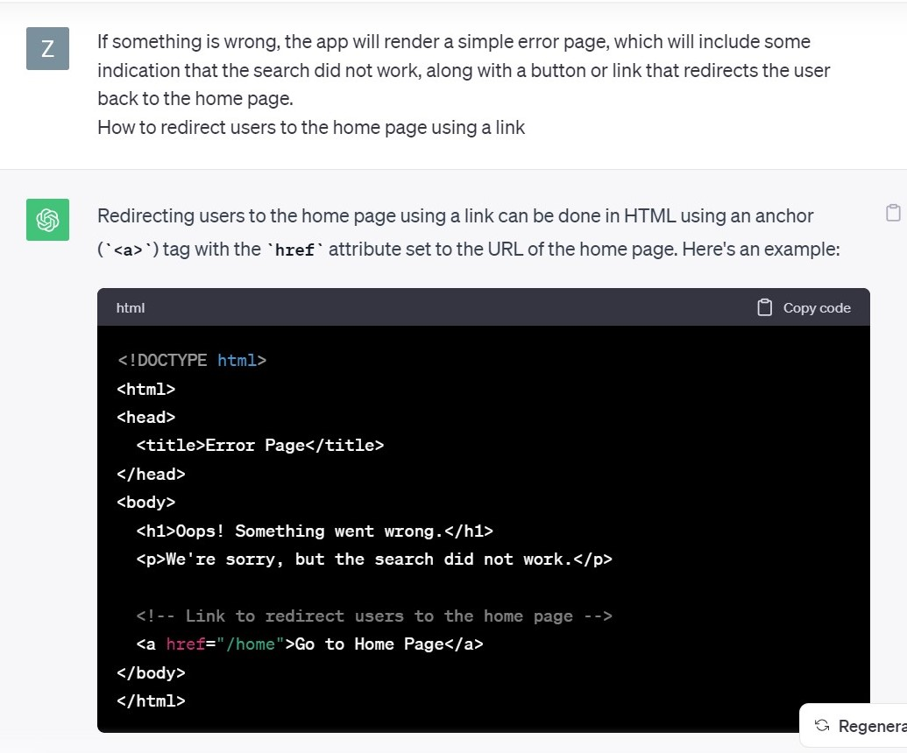

# Vicky Yan

**1. Project Overview** (~1 paragraph)

This project serves its purpose of providing users a nearest MBTA station and its weather based on the place users enter. The idea of this project is to first create mandatory functions to get the nearest station and weather. Then create a flask web page to integrate all element and make the process user-friendly. The web page would first welcome users with a "Hello!" headline. Then it asks users to enter a place in Boston in order to find its nearest station and weather. If the input and result are valid, it would render the user to another page, which tells the nearest station, its wheelchair accessibility, and its weather. If there's an error or the web page couldn't find a result, it would render the user to an error page, informing users to go back to the main page and try again. 

**2. Reflection** (~3 paragraphs + screenshots)

1. In fact, I made a lot of careless mistakes during the project, which really took me tons of hours to figure them out and fix them. I believe this is due to my lack of understanding and proficiency on this topic. For example, one careless mistake I made was that I changed one of my html file's name, but I didn't change it in my part2's app.py, which made the page not working. I tried to ask ChatGPT but it also couldn't figure this out. I had to spend many hours to read my code line by line to figure this out. What I could improve next time is defeinitely write my codes more careful and do not frequently make unnecessary changes after finishing a big part of code. Overall, other parts of the project went well. What helped me succeed was the project scoping. Although I encountered several challenges, I sticked to my original plans and goals and finally got the result I wanted. 

2. Since this was done individually, so I didn't have any team's work division. 

3. From a learning perspective, I learned and practiced how to create a web page using Python, which I believe is very helpful and practical. I was able to customize my web page to make them more visual and user-friendly. I think it's very helpful for me to present my work to general audience in the future, who may not be familiar with Python and have trouble running code in Python. ChatGPT helped me via teaching me something we didn't cover too much in class. For example, I didn't know how to include a link to direct users back to the home page. So I just asked ChatGPT, and it was very helpful. 

Still, I realized that ChatGPT is not omnipotent. When I encountered the problem of not matching html file names in code as I mentioned preciously, ChatGPT was not able to help me because it can not interpret the relationship among different files on our own laptop. Something I wished to know beforehand to help me succeed might be how to access different APIs efficiently. Because I had to spend many time figuring out how to deal with each of them. 