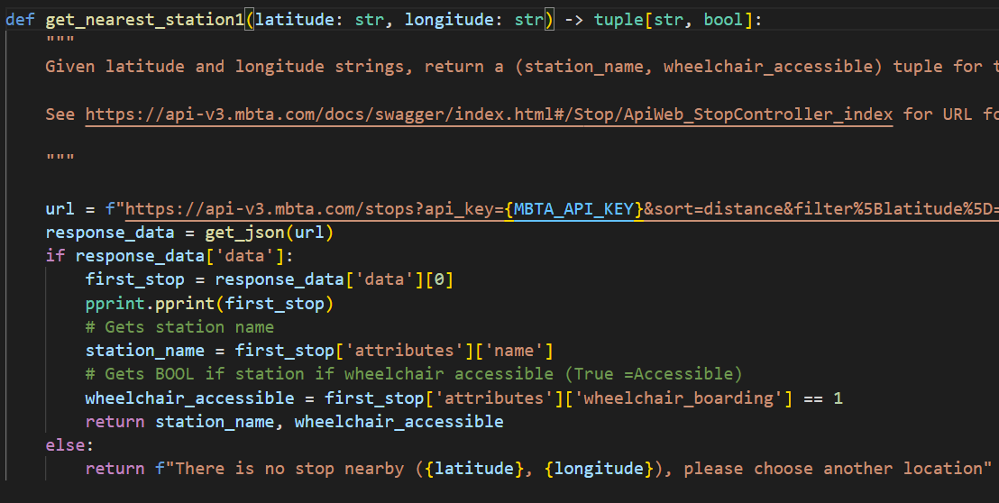
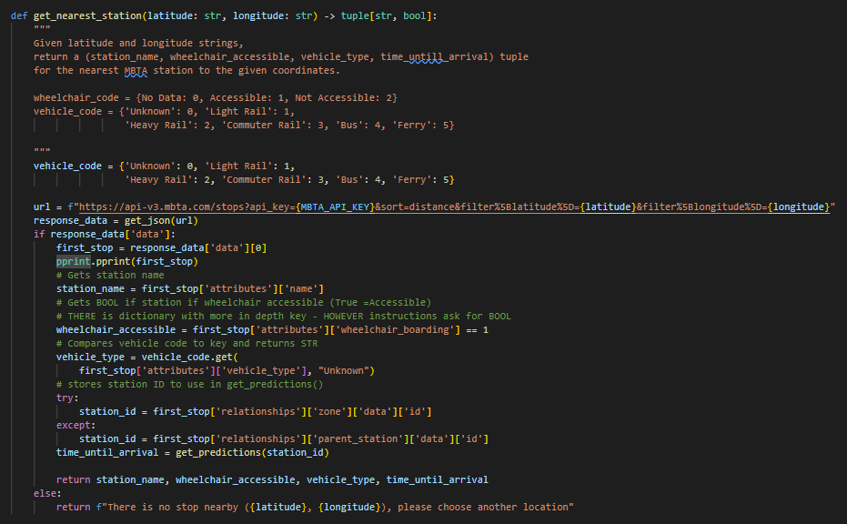
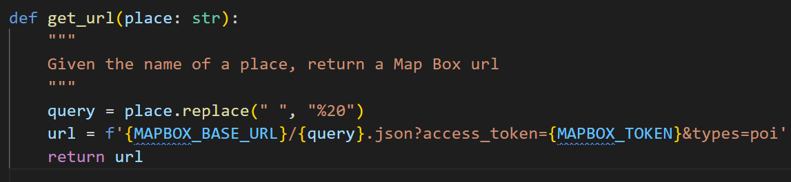
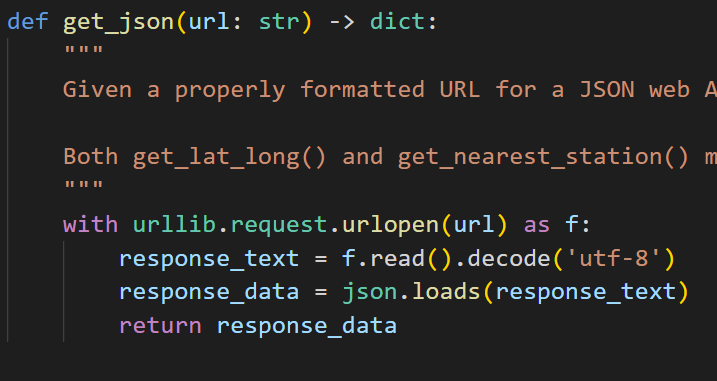
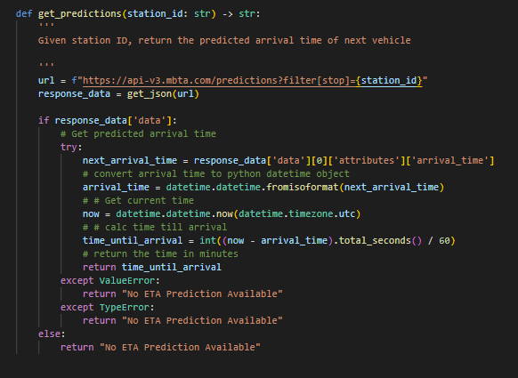
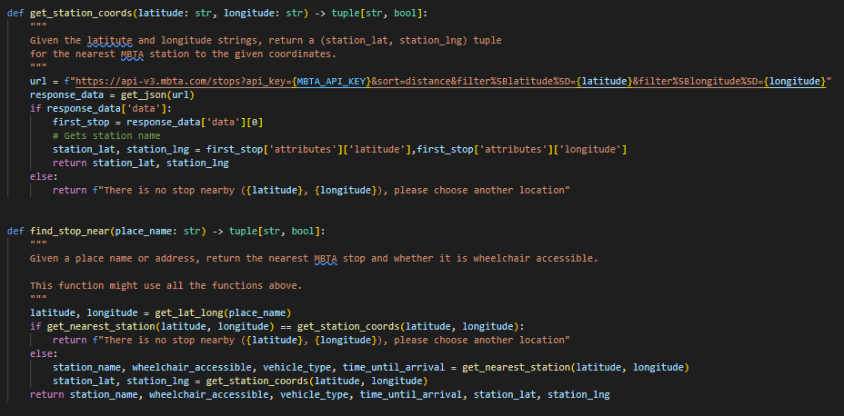
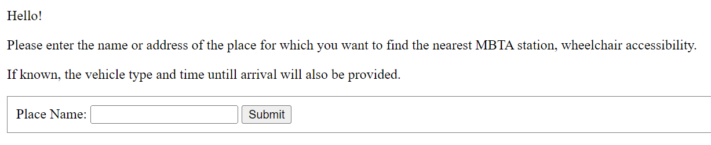
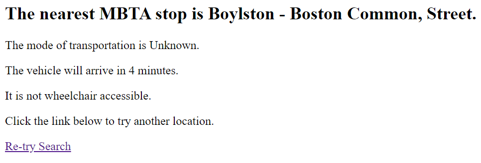
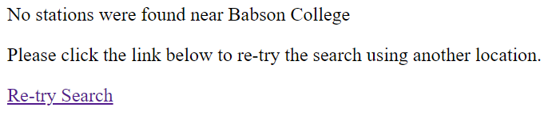

### MBTA - Assignment 3 - Sergio Avila & Naomi Wilson

## Project Overview 
Our project takes a location/address in Boston as an input and returns the closest MBTA Station as well as Wheelchair Accessible, the type of transportation at said station, and the time in minutes until the next vehicle arrives.
On the backend the project uses Python, libraries, and APIs to process the request. Input location is processed into a query which is fed to the geocoding function using MapBox API. Latitude and longitude are extracted and used as filters in the MBTA function which pulls out the Name of the Station, the Vehicle type, and if the station is wheelchair accessible. The station ID is stored and passed through to another function which pulls prediction data to find how many minutes the next vehicle arrives. 
On the frontend, the project uses Flask to build an app. This app initially displays an index page (http://127.0.0.1:5000/) with an input form requesting a place name. After the user clicks the “Submit” button, the app will render a mbta_station page in which the MBTA station, wheelchair accessibility, vehicle type, and time until arrival (in minutes) are displayed, in addition to a “Re-try Search” button that will take the user back to the index page to try another search. If the nearest MBTA station is not found, the app will render an error page that tells the user the search did not work and provides a “Re-try Search” button that will take the user back to the index page to try another search.

## Reflection 

1. What our team wanted was more time / examples of APIs and html templates and code that we could utilize to have more dynamic visualizations. We attempted to use Google Map API to display the coordinates visually - however were unable to troubleshoot the errors with the allotted time. Additionally, our limited knowledge of HTML acted as a limiting factor to what the end product would look like. That being said, the project scope was good. We made sure the basic features were working correctly before adding additional functionality, tested each function before moving to the next function This allowed us to modularize the functionality and build up from there. 
2. We split the backend and frontend equally – Sergio focused on the python functions to pull and process the data and Naomi focused on taking those outputs and passing them through a user-friendly web app interface. We met consistently and were able to work the project effectively once we were able to decipher the instructions. We worked on the same device at first as the work became clear and then we split up the front back end to work during our own time. Next time we would work differently by making different file versions with our names to avoid confusion and losing edits when we are both simultaneously working from different devices. 
3. We learned how to effectively combine backend and frontend development, which will aid us in future classes and careers - especially for the final project where we hope to have a user friendly interface. ChatGPT helped with debugging and deciphering the code documentation for MBTA .This allowed us to find the prediction data for estimated time of arrival as shown in the get_prediction() function. Below are some screenshots depicting an example of the progress functions took on as we advanced.

### Below is the progress of the Backend
1. Image depicts function with bare minimum capabilities. 
   

2. Image depicts final version which of main function 
   

3. These are auxillary functions to split and modularize work 
    
    
    
  

4. The end function uses main function in conjunction to pass relevant data to backend.  
    

### Below is the Outline of the Front End

1. This is the main user interface page
    
  
  
2. This is a sample output if "Boston Commons" is entered
   
  

3. This is the sample output when "Babson College" is entered which returns error statement as there is no nearby station and redirects user to main page. 
 
   
