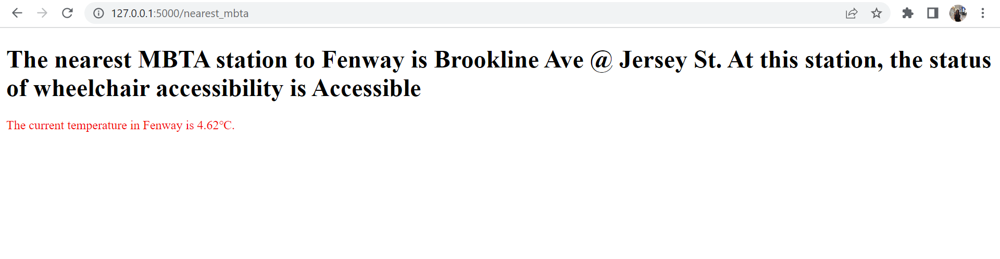
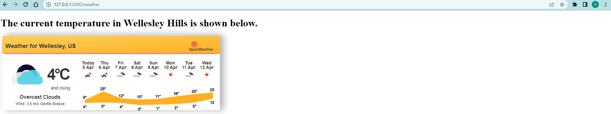
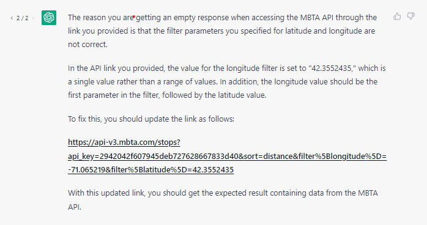
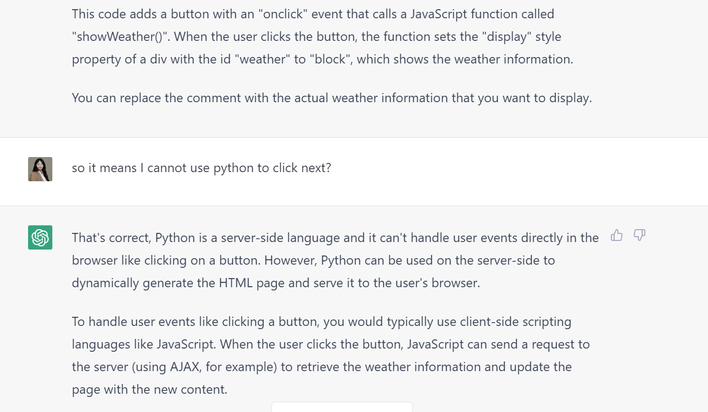

Gina Zheng; Xiaolun (Amanda) Liu

**1. Project Overview** (~1 paragraph)

Our project focused on making a webpage where users can input the place name and then identify the nearest MBTA station, whether wheelchair are accessible, and the temperature at the location. We had two helper functions: mbta_helper and getweather to build this web. The getweather was based on class function with some of ours modification. The primary use was to determine the temperature of certain location by using openweather api. We linked the getweather.py with the longtitude and latitude information we gathered through the mbta_helper.py which we'll explain further. mbta_helper.py contains multiple functions that serve different purposes. The first function retrieves responses to a request in the form of a Python JSON object. It does this by taking a properly formatted URL for a JSON web API as input. The second function converts a location name into its corresponding latitude and longitude coordinates. The third function finds the nearest MBTA station based on the latitude and longitude coordinates obtained from the second function. Lastly, the fourth function takes a place or address as input and returns information on the nearest MBTA station, including its wheelchair accessibility status. The app.py uses falsk and four html. to prompt users enter a location and return the results. We also included a second form that asks users for a input of a city name. The submit button on this form routes to the weather.html which gets information from getweather.py that takes the longitude and latitude of the city using formula from mbta_helper.py and returns the city id which is needed to show the weather widget. In addition to this, we also used SQLite to keep user information in the database that we created. All user entries that occur when pressing the submit button for finding the nearest station is saved in the database table. 

**2. Reflection** (~3 paragraphs + screenshots)

After you finish the project, Please write a short document for reflection.

The overall process went pretty well. We started by having a logic of how we are going to build the web and followed through it. The class materials were a big help to us when writing the project and it was fun to connect multiple API with Flask at the same time. There are also things that it'd be great to know before starting this project, e.g. knowing that web interaction does not go smoothly with python. We tried to use 'click next' so users can jump to the weather.html (the reason why it exists in our template) but figured this is not supported in python but javascript. We then decided to create two forms from the home page to direct to two different pages. Learning more about the benefit of each coding language would help improving our project. 

One challenge we had was when we tried to get the MBTA api to get us the nearest station at first, we had a hard time getting the right response from the server. Apparantly, the longitude and the latitude were not in the right order. We finally understood it with the help from ChatGPT. See picture below.

1. Discuss your **team's work division**, including how the work was planned to be divided and how it actually happened. Address any issues that arose while working together and how they were addressed. Finally, discuss what you would do differently next time.

Our team had a reallly good dynamic, where we both wrote some of the mbta_helper.py & app.py, I (amanda) wrote the getweather part for extensions and gina was taking charge of building html.template, and the sql part. Gina fixed lots of my codes which are not functioning and I checked the web design. We do not have any issues while working together except one time there was some conflict of code when we did not push code as soon as we finished.

3. Discuss from a learning perspective, what you learned through this project and how you'll use what you learned going forward. Reflect on how ChatGPT helped you and what you wish you knew beforehand that could have helped you succeed. Consider including screenshots to demonstrate your project's progress and development.

**Amanda**

I learned about user interaction through this project. Different coding languages serves their own purpose and does not necessarily share the similar useage. Chatgpt helped to explain the user interaction design difference in python and javascript. 

In the future, I will strive to improve my work, especially in the term project, by integrating different Python programs. I have found that organizing programs according to their usage is highly effective in terms of readability and comprehension. By having programs call on each other, I can maintain a more organized structure rather than having all functions in one document.

**Gina**

From this project I learned a lot on the usage of api and the different ways it could be integrated with Flask to work on the backend of a webpage. Working with different languages from python to HTML to JS can be confusing sometimes but with the help of ChatGPT, it certainly made my life a bit easier at times.
During this project, the time when I relied on ChatGPT the most was when I was working with the sqlite for creating a database on user inputs. At first, I attempted to install SQLAlchemy for this process, but soon gave up when it became a little complicated. I resorted back to the SQLite that was taught in class which was a much simplier approach. I used a lot of testing (code under the folder test_codes) to run code separately from Flask because it was getting hard to see which line exactly caused the error to happen. This was really helpful and I think I will continue this method going forward.

**Note**: 
- Begin by including the names of all team members at the top of the document.
- Make the `README.md` file clear and concise. There is no need to use fancy words or ChatGPT. 
