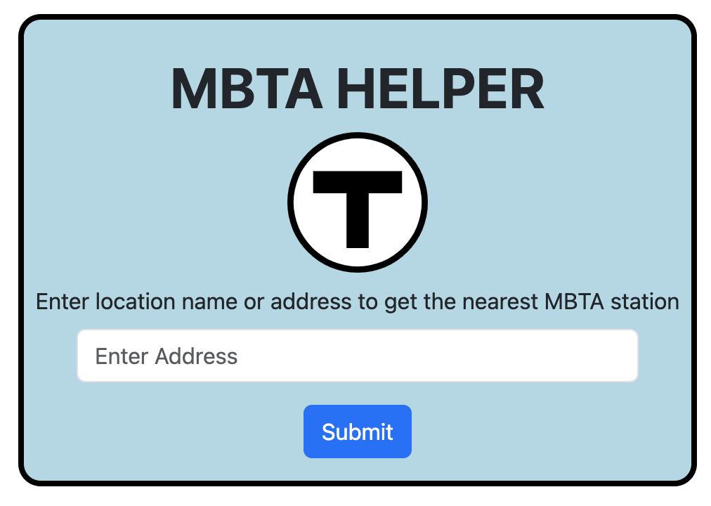
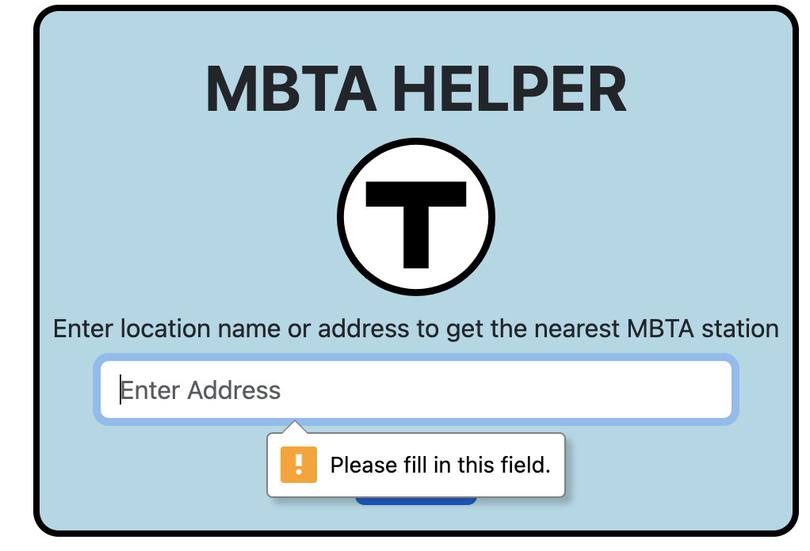
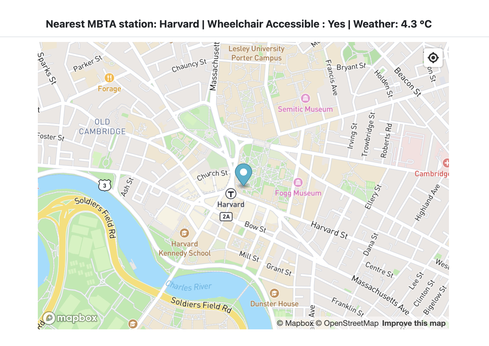
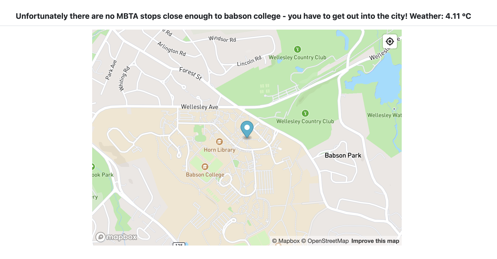
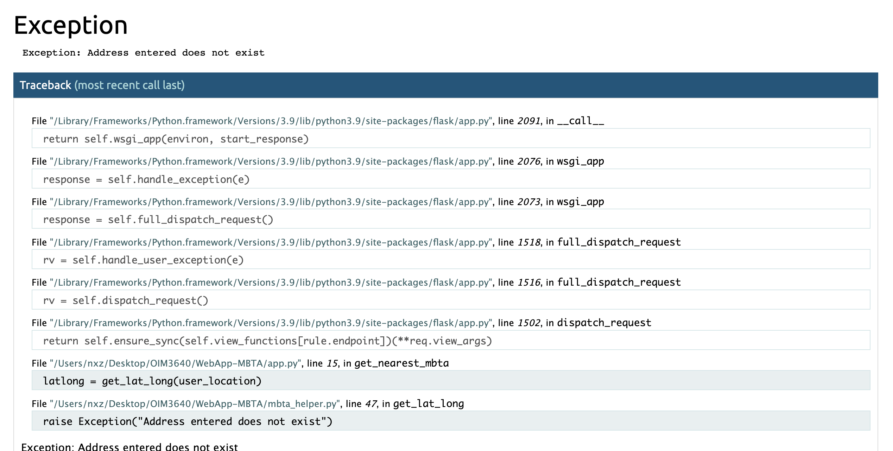

# WebApp-MBTA
**Group members: Matteo Sta Maria, Xue Zhen Ng**

## 1. Project Overview (~1 paragraph)

<!-- Write a short abstract describing your project. Include all the extensions to the basic requirements.  -->
Our project is an MBTA helper. The point of this project is to be able to find the closest MBTA station for any given location. This required the use of web APIs such as Mapbox, an API which we used to receive a location's latitude and longtitude, along with the MBTA-realtime API in order to find the closest MBTA station to the given latitude and longtitude. We also built a Web App that allows users to interact through an interface. In order to do this, we utilized Flask, a web framework.

In addition to the basic requirements, we went above and beyond in several ways. Firstly, the MBTA Helper page on the web app has a clean user interface that goes along with the MBTA Theme and even has a logo. The color scheme, font and border all make it appear as if it was from the actual website. Another extention we included was adding the weather in Celsius of the given location. Lastly, we used Mapbox in order to embed an actual map with the location pinned. This was done so that users get a better clarity of the surroundings, especially visually showing the nearest T stations.

## 2. Reflection (~3 paragraphs + screenshots)

### Process
<!-- Discuss the **process** point of view, including what went well and what could be improved. Provide reflections on topics such as project scoping, testing, and anything else that could have helped the team succeed. -->

For this project, we utilized bootstrap to add dynamic elements to our web app, including beautifying the landing page and form validation. We also decided to add more features to our webpage - current weather and mapbox map. 

What went well was that our webpage was able to give the outputs of the nearest MBTA, and the map was able display search results for the user's input. However, we were unable to pass data dynamically from the flask app itself directly into javascript, to pass the coordinates of the user's input from the flask function using handlebars. Thus, to work around this, we were able to access the data from the HTML section, and then use DOM manipulation to access the hidden element to obtain the innerHTML value - which is the coordinates that we want. 

||Screenshots from the webapp|
| ----------- | ----------- |
| landing page form |  |
| form validation for no input |  |
| successful output |  |
| no search results output |  |
| location does not exist output (raise Exception "Address entered does not exist")|  |

### Team's Work Division
<!-- Discuss your **team's work division**, including how the work was planned to be divided and how it actually happened. Address any issues that arose while working together and how they were addressed. Finally, discuss what you would do differently next time. -->

### Things learnt
<!-- Discuss from a learning perspective, what you learned through this project and how you'll use what you learned going forward. Reflect on how ChatGPT helped you and what you wish you knew beforehand that could have helped you succeed. Consider including screenshots to demonstrate your project's progress and development. -->

We learnt how to utilize a flask app, and to redirect user to a html file. We also learnt about dynamically accessing and passing data through props using flask, and then accessing the data from the html file. 

We also learnt how to use python libraries such as urllib.parse to convert the user's string input into url form, which can then be passed into the URL to access the mapbox API. 
