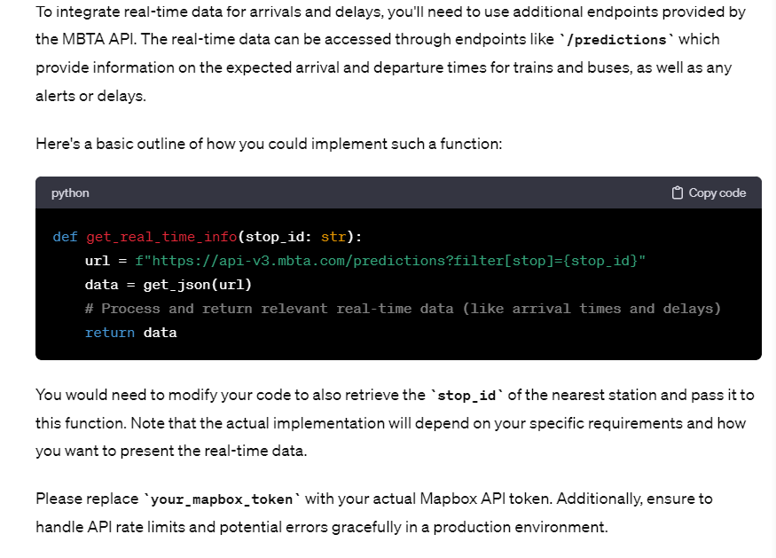

# WebApp-MBTA
 Team members: Linhao Jiang, Jasmine Zhang

# Project Overview

Our project aimed to assist users in locating the nearest MBTA station to their input address and checking its wheelchair accessibility status as well as other information like nearby restaurants and events. We use MAPBOX API to convert user-input addresses into coordinates, and then MBTA API with these coordinates to find the nearest subway station and assess its wheelchair accessibility status. Other APIs like OpenWeather for weather forecasts, Ticketmaster for local events, and Google Maps for restaurant recommendations. 

The core functionality of our application stays in the **mbta_helper.py** page, which interacts with those external APIs. The Flask framework is powered by **app.py**, it sets up the website and routing. When the user lands on the first page, will see a simple form where the user inputs their address via **index.html**, and receives detailed information on **results.html**, with error handling implemented in **error.html**. Our project functions beyond merely finding the nearest MBTA station, we also aim to include valuable local context and real-time updates. 

# Reflections

One thing we changed very late in the process is that we decided to use the Google Map API to get the weather information and the city name because we found if we use MBTA API, for these places without a station nearby, we cannot output weather data, which is not logical. 
For the nearby restaurants for stations, we planned to use Yelp API but we found it very hard to apply and not intuitive to use, so we pivoted to Google Map API. And since it's our first time handling Google Map API, I've asked ChatGpt for guides. 

](images/google_map_api.png)

For mbta_helper.py, our initial version was stored in **help_attempt.py**, later we decided to use the template that Professor provided because it was more consistent with using **urllib.request**, in contrast, we initially mixed **'urllib.request'** and **'request'**. We believe that having consistency in using libraries can make code more uniform and easier to read.

For team collaboration, we initially planned frequent in-person meetings but due to scheduling conflicts, the approach was adjusted. Jasmine took the lead on initial development, laying down the groundwork for the application, Linhao served as the debugger and perfectionist, fixed Jasmine's bugs, and enhanced functionality by applying additional APIs. Despite the shift from our initial plans, our team dynamic is very good, we had active communication through online discussions, and we also used live-share, to effectively address overlap in progress. 

*What went well:* we successfully integrated multiple external APIs (Mapbox, MBTA, OpenWeather, Ticketmaster, GoogleMaps). 

*Areas for improvement:* 1. maybe better interface and user experiences   2. In the future, we hope to gather user feedback through big-data analytics, surveys, and usability testing to see the improvement they desire. 

*Learning Perspective:*
We gained more hands-on experiences with Flask, and learned how to handle various APIs associated with multiple external services. 

In the learning process, ChatGpt serves as an assistant and debugger, offering guidance and support in areas where we lacked expertise and knowledge, such as with HTML template styling.

There's so much to learn in HTML templates, ChatGPT could be a good tool to be used to answer our curiosities. I have asked what < Li >means in the HTML template.

](images/html_learning.png)
