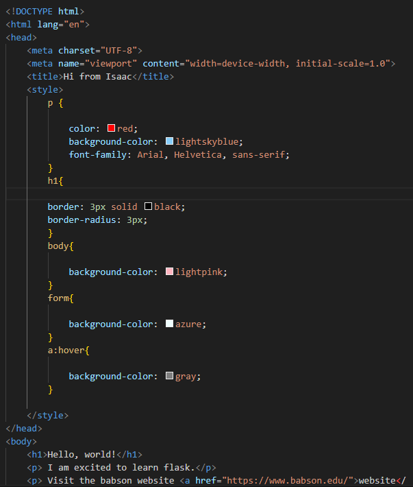

# WebApp-MBTA

#### I did this project alone.
#### To start the program first run APP.PY, then type this in your browser: http://127.0.0.1:5000/mbta/

## Project Overview

+ This project facilitates the access of public transportation information for people in Boston. It allows a users to enter the name of a location in Boston and users receive information about  the nearest MBTA station to the place they entered and wether it's wheelchair accesible or not. The project is a web application with Python backend and frontend coded in HTML and a little bit of CSS (index.html) and it is made possible by using Flask framework (app.py). I used the Mapbox Goeocoding API to get the coordinates of a location entered and also the MBTA API to get real time data of the nearest MBTA location. The get_lat_long function is an intermediary that passes data to the find_stop_near function by providing critical coordinate data. The process begins when a user inputs a location name, which is then transformed into geographic coordinates through the Mapbox Geocoding API. These coordinates are crucial inputs for the find_stop_near function, which leverages this data to get the nearest MBTA station and determine its accessibility for wheelchair users. The get_json function takes the address of a website designed to give us data in JSON format. It then asks that website for the data, reads the data it gets back, and changes it into a format that our Python program can work with. This function is used by other parts of the program to get the location and information about the nearest MBTA station.

## Reflection 

+ I did this project alone, I believe that doing it alone had its benefits and tradeoffs. I felt that I learned more and took a lot of accountability instead of dividing tasks, now I feel that I understand every component of the code which is very rewarding.

### Organizational lessons
From a learning perspective, I learned that organization is key and breaking down problems into smaller pieces is the best approach, but this took me some time to realize. The first day I was assigned the project I started working on it. I was very overwhelemed by looking at all the instructions and tried to do everything at once and getting ahead of myself, I even started creating the indef.html file before creating functions in the mbta_helper.py or the Flask in app.py. I then realized that I was moving too fast and skipping steps and I got to a point where I did not know what was going on and nothing was working when I clicked on run. I had to go back some steps, and made sure that I worked step by step and testing everything before I continued to the next step.                       

### Process point of view
+ I took advantage of code that I had worked on recently in class because it was very relevant for this assignment (Weather flask). For the Flask and HTML part I guided myself from the weather problem we did using flask in class in terms of the @app.route part. For error handling I was having some issues and the professor suggested to look at the webapp-demo and taught me how to fix it in class . I realised that there were some locations that werent working because there wasnt an MBTA station near enough so I decided to say: could not find mbta station near {place name}. I have also learned how to be more detailed in my work by adding images the correct way, doing a config.py to place my API keys to not expose them, and learned how to do markdown format properly, these have all been issues or things that I wasn't so good at before or did not see the value and now I do. While enthusiastically showing the project to friends I realised that a lot of people don't know what MBTA stands for, the professor said in class to think like a user. So I added MBTA =  Massachusetts Bay Transportation Authority in the page to make it more clear for users. I also learned that by inputting a specific location address you get better accurate results, so I decided to notify this to the user in the interface "For accurate results, write the complete street address".

### GPT and Learning perspective
+ Sometimes when my code didn't run and didn't really did not know what to do or what was the issue I ask GPT to see if it knew where my error was and I specifically told it to guide me through my errors without revealing the final answer. I used GPT to teach me new commands for HTML/CSS inputting a code we did in class and then I did trial and error until I got what I wanted. This was my prompt: . I forgot how to format my code, so GPT helped me . From the weather app.py I used it as a guide from the MBTA app.py . I also used GPT to understand certain concepts and terms that I wasn't as familiar before that I encountered along the way. I learned that the best way of learning is changing and testing to see results. At the end I asked GPT to give me some suggestions on my code and this was one of the things I added .

