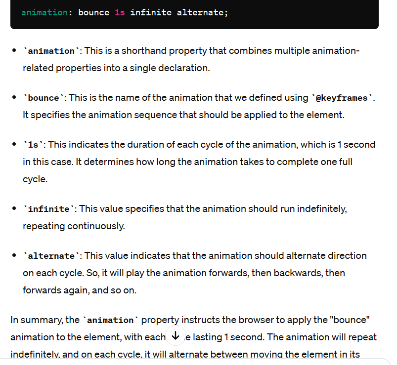

# Team member: Nan Wang
## Project Overview
### The project's purpose is to help the users navigating the nearby MBTA stations, nearby TicketMaster events, weather, and nearby hotels. The website I created asks the user to enter a location. This project will be helpful for people who are traveling and want to save time on researching. I used MBTA API, OPENWEATHER API, TICKETMASTER API, and BOOKING_API FROM RAPID API. I used Flask to create the webpge and made the website looks visually aethetic.
## Reflection
### I think the use and integration of different APIs were successful and went well. I looked back at the previous examples we did during classes with the OPENWEATHER API and building html using Flask. Specifically, I enjoyed creating the webpage and can decorate it into any style I want for visualization.
### Since I am working on the project alone, I did not have any problems in collaborating with others and splitting up the work. The important lesson is to get start on the project early.
### I ran into several problems where my code was not working. When I defined the function that gets MBTA API data and needed to link all four files together, mbta_helper.py, app.py, index.html, and mbta_station.html. Here's the link to my conversation with ChatGPT: https://chat.openai.com/sharec4d822bc-6160-4da6-bba5-2f433e26f0b9. Here is a screenshot.
### ChatGPT was also helpful in helping me organizating the files. At first, I had my styles.css file under the templates folder, so my code was not working because my index.html and mbta_station.html are linked to styles.css. So I asked ChatGPT how should I organize the files under different folders, and it resolved the problem.Here is the link to the full conversation: https://chat.openai.com/share/a0436ed2-aad9-4b3b-8ed4-92d6420f938b 
### ChapGPT has also helped me in debug. For example, I got error messages saying "get_ticketmaster_events() missing 1 required positional argument: 'TICKETMASTER_API_KEY'",but I didn't get any red underscore or obious errors. So I pasted the errror messages to ChaptGPT and asked where's the problem. It turned out to be a simple overlooking mistake and it was very easy to fix. But without ChatGPT, it will take much longer to fix it. Here's the link to the full conversation: https://chat.openai.com/share/6fc5491d-e01f-4b35-9b69-938a4a5808e3