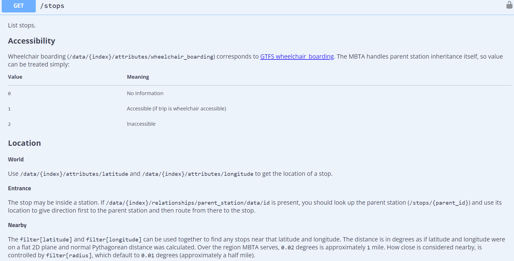

# 1. Project Overview

This project is a web application that helps users find the nearest MBTA station to a location that they provide. Using FLASK, it can obtain the latitude and longitude for the place and then uses the MBTA API  to find the closest station, if there is one. It then looks to see if the station is wheelchair accessible. In addition to those requirements, it finds the temperature for boston, which is where most of these stations are located. It also shows the way the temperature actually feels, in addition to the temperature. It changes the temperatures from celsius to farenheit. It finds this information using the OpenWeatherMap API. The user interface, crafted with HTML, has a search bar, map illustration, and error page for user interaction.

# 2. Reflection

When I began, I started with just doing the requirements which seemed like a good idea at the time. But when I eventually went back to integrate get_temp, I was having some trouble figuring out where to put it and how to integrate it with the web application. I wish I had started expecting myself to add this in later on. If I had, I would have had a clear outline for where I was going and been thinking about where that componenet would fit the entire time. It was also a little difficult to integrate the form with my code at first. It was something new, but I eventually got the hang of it and felt very accomplished when it worked.

What went well for me was creating the functions. It was familiar to me and I enjoyed using my knowledge to create a program that performed a function. Designing the interface was probably my favorite part of the project. I learned more about forms and buttons and how to display information that came from an entirely different page. I also wanted to add something fun to my interface and learned how to make my title on the index page scroll. 

The main thing I learned was integrating my program with the web interface. It was exciting to see my code presented on a tangible web page. ChatGPT helped me learn some fun features like how to get my title to scroll (Picture Below). It also explained errors to me and some reasons it could be occuring so that I was able to go back and fix my code and get it to work(Picture Below).

