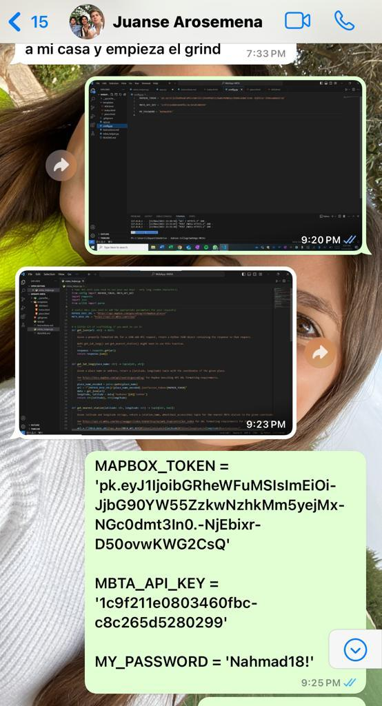

# WebApp-MBTA Project Writeup and Reflection

- Luna Dayan
- Juanse Arosemena

## Project Overview
This project is about the development of a web application design to locate the nearest MBTA station to the user's choice of address. We build the application using Python and Flask, and the MapBox and MBTA API'S for geolocation and transit data. The appliplication allows the user to enter an address and then displays the nearest MBTA station along with its the status if the station is wheelchair accessible or not. Furthermore, we added two perks to this app, on one side we changed the color of the wheelchair accessible output (yes or no) to green and red as a nice detail. On the other side, we added the distance of the nearest MBTA station to the user's location by utilizing the haversine formula and the functions needed from the math library.

## Reflection
### Process
We created a web app to locate the nearest MBTA station using Python, Flask, MapBox, and MBTA APIs. Flask provided flexibility, and MapBox and MBTA APIs gave us geolocation and transit data. User-friendly touches like color-coded indicators for wheelchair accessibility and Haversine formula for distance calculation boosted the project appeal. However, we could improve the user interface and error handling for better user interactions. The site is not the prettiest one out there. 

### Team's work division
Although we did divided the work, we mostly worked together either in person or on facetime. Luna is definitely profitient in Flask, so she lead that aspect of the project. However we were both always involved in the decision making of the App. An example of how we worked together being choosing the wow element in which we both agread that it would be usefull to add the distance specially in KM. The only thing we would do different in the future would be working more in person and sincronozing our push/pulls to Github as on a few ocasions, we overwrote eachother.
Besides overwriting each other on VS Code, the only ther issue that arose was having one of us attend the others class as we have different schedules, however Juanse compromised and went to Luna's class time which gave us time to work together in person.

The image bellow is a method of communication between us. When we couldn't talk on the phone and share our screen, we Used Whatsapp as our third party. 
    

### Learning perspective
The project provided a valuable learning experiences,as it allowed us to experience the process of using external APIs, understanding geospatial calculations through the Haversine formula, and recognizing the importance of UI.
We also increased our problem-solving skills as we had to debugg and resolve the issues related to the API integration and the code. 
ChatGPT was helpfull for error-solving and generating ideas during the development process. It helped when we wanted to do something but didn't know how to. 

An example of our use of ChatGPT was when we wanted to put color on the wheelchair accessibility results. We tried one way but wasn't working so we asked ChatGPT to fix it for us. 
    

The skills learned and gained from this project will help us both in the future for software development and our final project. We have a deeper understanding on Flaks and API integration. 

