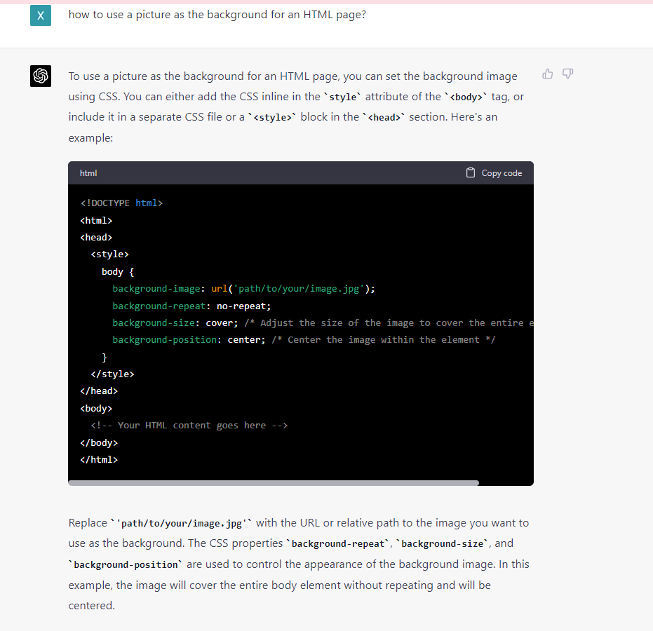

# Web App Developement Project
## Team Members
Angela Wong
Katarina Wang

## Project Overview 
Our project aims to provide users with a simple and efficient way to find the nearest MBTA station based on a given location, while considering the user's preferred route type and the station's wheelchair accessibility. We developed a web application that leverages the Mapbox Geocoding API and the MBTA API to deliver accurate, real-time information to users. In addition to the basic requirements, our project offers a more comprehensive and accessible solution for users seeking MBTA station information tailored to their specific needs, ultimately enhancing their overall public transportation experience. The additional features include a route type filter, allowing users to specify their preferred route type (subway, rail, bus, or ferry) to narrow down the search results and find the most suitable station based on their travel needs. Moreover, the application offers a user-friendly web interface where users can input their desired location and route type, and view the nearest station and accessibility information in a clear and visually appealing manner.

## Reflection
From the process point of view, the initial planning, scoping, and presenting stages of the project went effective. Steps to reach the final stage were identified from the very beginning, including acquiring APIs, establishing functions to request information, extracting nearest stations, and implementing on a user interface. Through breaking down the project into manageable components, we designed an HTML page with a smooth user experience and additional features (search by transportation types). The testing phase went well as it provides accurate information about nearest MBTA station and wheelchair accessibility. Through decorating the HTML pages, we made the page easy to follow for end users. There is room for improvements, though. For example, we can add real-time data to calculate the time to the nearest station/stop by walking. 

In terms of team’s work division, we basically divide the work into two parts: dealing with geographical data and building websites. At first, Katarina created a tool that takes a place name or address as input, finds its latitude/longitude, and returns the nearest MBTA stop and whether it is wheelchair accessible. Then, Angela reviewed the codes, added additional features and building a website for end users to use. The work went smoothly in that we were able to finalize out work in time and review others’ codes for improvements. For next-time collaboration, we might consider to switch our tasks so that we can be exposed to different toolkits and further improved our coding skills.

The project walked us through the process of constructing a website, processing data from external sources and designing user interface. In addition, we recognized how to structure an application in a modular way, with distinct functions handling specific tasks. This made the development process more manageable, and it will be easier to maintain and update the code in the future. During the process, ChatGPT was a valuable resource in providing guidance, suggestions and explanations. For example, when decorating the HTML page, we were trying to use an external image as the background. ChatGPT can give us an instance as a guide for us to follow (as is shown in the attached png file). Looking forward, we will apply the lessons learned to tackle new challenges more effectively. The lessons learned in the section of user interface or HTML buildup can guide us forward to create more complicated websites to make lives more convenient. 

## Attachments

